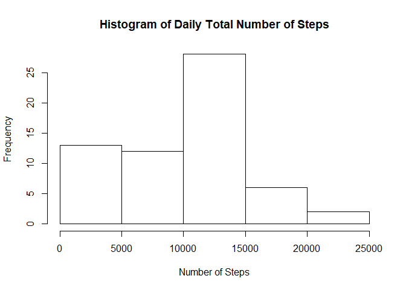
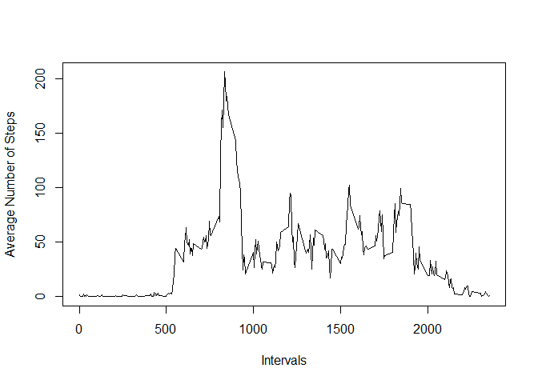
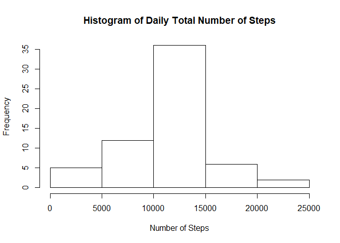
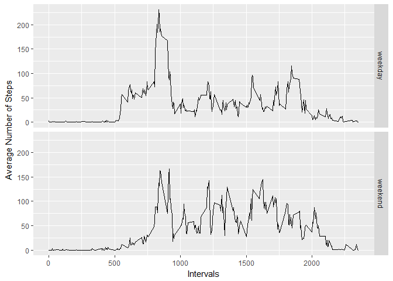

# Reproducible Research: Peer Assessment 1


## Loading and preprocessing the data

First, we will load the data.
The zip file is already at the main directory.


```r
DB <- read.csv(unz("activity.zip", "activity.csv"), header = T, sep=",", na.strings = "NA")
```

Now, we will load lubridate package, and set the date variable as date, with the proper format.


```r
library(lubridate)
DB$date <- ymd(DB$date)
```


## What is mean total number of steps taken per day?

First, we will load the `dplyr` library.
Then, we will save on `spd` the number of steps, grouped by date (ignoring the NAs.)
Finally,  we will plot a histogram of the total number of steps taken each day.


```r
library(dplyr)
spd <- DB %>% group_by(date) %>% summarise(Number.Steps = sum(steps, na.rm=T))
hist(spd$Number.Steps, main = "Histogram of Daily Total Number of Steps", xlab="Number of Steps")
```

<!-- -->

Now, we will calculate the mean and median of the total number of steps taken per day.


```r
mean <- mean(spd$Number.Steps, na.rm=T)
median <- median(spd$Number.Steps, na.rm = T)
```

The mean is 9354.23, while the median is 10395.


## What is the average daily activity pattern?

In order answer it, we will make a time series plot, with the 5-minutes interval on the x-axis and the average number of steps taken, averaged across all days on the y-axis.  
So, first, we will group the data by interval and summarise it, before plotting it.  
Then, we will identify the interval that contains the maximum number of steps.


```r
spi <- DB %>% group_by(interval) %>% summarise(Number.Steps = mean(steps, na.rm=T))
plot(x=spi$interval, y=spi$Number.Steps, type="l", xlab="Intervals", ylab="Average Number of Steps")
```

<!-- -->

```r
max <- max(spi$Number.Steps)
interval <- spi$interval[spi$Number.Steps == max]
```

The interval 835 contains the maximum average number of steps: 206.17.


## Imputing missing values

Calculating the total number of Missing Values:


```r
sum(is.na(DB))
```

```
## [1] 2304
```

So now, we will create a new dataset, `DB2`, with the NAs values filled in with the mean of steps of their 5-minutes interval in the other days.


```r
DB2 <- DB %>% group_by(interval) %>% mutate(steps = ifelse(is.na(steps), mean(steps, na.rm=T), steps))
```

Therefore, we will re-plot the histogram of the total number of steps by day, but now with the NAs filled in, and re-calculate the mean and the median.


```r
spd2 <- DB2 %>% group_by(date) %>% summarise(Number.Steps = sum(steps, na.rm=T))
hist(spd2$Number.Steps, main = "Histogram of Daily Total Number of Steps", xlab="Number of Steps")
```

<!-- -->

```r
mean2 <- mean(spd2$Number.Steps, na.rm = T)
median2 <- median(spd2$Number.Steps, na.rm = T)

diff_mean <- abs(mean - mean2)
diff_median <- abs(median - median2)
```


The old mean (removing the NAs) is 9354, while the new one (filling them) is 10766. It is a difference of 1412 steps.  
The old median is 10395. The new one is 10766. It is 371 steps of difference.  
So, we can conclude that imputing the missing data on the estimates of the total daily number os steps increases the mean and the median of steps. It happens because, in the beginning, as the NAs were ignored, it was the same (for summing proposes) that setting them as zero.


## Are there differences in activity patterns between weekdays and weekends?

In order to answer it, we will first create a new factor variable in the dataset, with the values `weekday` and `weekend`


```r
DB2$Weekday <- as.character("?")
DB2$Weekday <- ifelse(wday(DB2$date) == 1,
                      "weekend",
                      ifelse(wday(DB2$date) == 7,
                             "weekend", 
                             "weekday"))
DB2$Weekday <- as.factor(DB2$Weekday)
```

Then, we will plot the data, comparing these factors.  
Before, we need to create the summarized table, to be used on the chart.


```r
spi2 <- DB2 %>% group_by(interval, Weekday) %>% summarise(Number.Steps = mean(steps, na.rm=T))

library(ggplot2)
qplot(x=interval, y=Number.Steps, geom = "line", facets = Weekday~., data = spi2, xlab="Intervals", ylab="Average Number of Steps")
```

<!-- -->

As we can see, there are some differences among weekdays and weekends activities.


